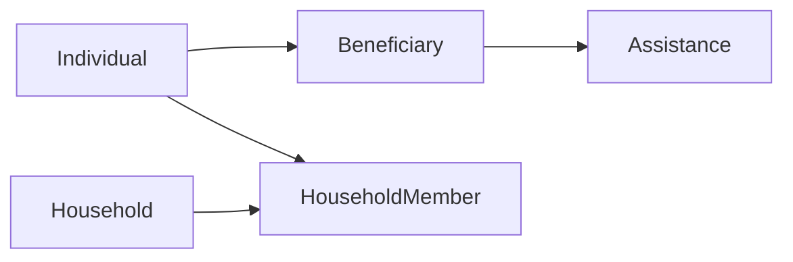

# Household / family grouping

Status: **planned** (not implemented). Roadmap item 9 in [cais-feature-roadmap.md](cais-feature-roadmap.md).

Relief is often household-based. Staff need a household record so they can see that a family already received aid even if a different member applied.

---

## How this fits the current setup

Aid stays on **one applicant**. `Assistance` already has a single `beneficiary_id`. `Beneficiary` is a morph over `Individual` / `Organization`. Households are a **grouping overlay**, not a third `beneficiable` type.

Organizations already group people (`individual_organizations` + president). Households copy that pattern for **families**, but the household itself never receives assistance. Organization programs are out of scope.

Beneficiaries are **city-wide** (no `department_id`). Households follow that: any department can see the same family, which is the point of “another member already got aid.”

### Locked product rule

At encode, another member’s open or delivered request in the same program family is a **soft** finding. Staff must enter `eligibility_override_reason`, same as today’s `open_request` / `cooldown` in `GuardAssistanceEligibility`.

Per-person cooldown and item caps stay per applicant (not rolled up to the household).

### Out of scope

- Auto-merging by address or last name
- Converting the free-text `individuals.spouse` field into a linked member
- Household as a `beneficiable` (households do not receive assistance)
- Applying cooldown / yearly item caps to the whole household

---

## Data model

New tables (Artisan migrations; do not edit old ones).

### `households`

- `code` unique (`HH-YYYY-####`), reserved via existing `BeneficiaryMorphService::withReservedCaisNumber` with prefix `HH`
- `name` nullable (e.g. “Dela Cruz household”; default from head last name + barangay)
- `head_individual_id` FK → `individuals` (same idea as `Organization::$beneficiary_id` for president)
- `address_barangay_id` FK → `address_barangays`
- `other_address` nullable
- `notes` nullable
- timestamps + soft deletes

### `household_members`

- `household_id`, `individual_id`
- `role` string backed by enum `HouseholdMemberRole`: `Head`, `Spouse`, `Child`, `Other`
- unique `individual_id` (one household at a time)
- unique `(household_id, individual_id)`
- timestamps

Head must also be a member with role `Head`. Moving someone who already belongs elsewhere is a validation error (“already in HH-…”) until staff detach them.

Extend CAIS uniqueness in `BeneficiaryMorphService` (`resolveLatestCaisSequence` / `caisNumberExists`) so `HH-*` cannot collide with `PRO-*` / `ORG-*`.

Models: `Household`, `HouseholdMember`; `Individual::household()` / `householdMembership()`. Keep `spouse` as free text.

---

## Backend

Follow existing layers: thin controllers, Form Requests (department match via `AuthorizesDepartmentBeneficiary`), Service for writes, Action for eligibility. No Spatie permission checks (policies today are department-only).

### Service

`app/Services/User/HouseholdService.php`

- `create` / `update` (head + members + address)
- `attach` / `detach` / `changeHead`
- `showPayload` (members with morph beneficiary id, last assistance summary)

### Routes

Under `{department}` in `routes/web.php` (same `EnsureUserBelongsToDepartment` middleware as beneficiaries):

- `GET/POST households`, `GET households/{household}`, `PUT households/{household}`
- `POST/DELETE households/{household}/members` (attach/detach)

No nested assistance resource. Use Wayfinder (`@/routes/user/households`).

### Eligibility

Extend `EvaluateAssistanceEligibility` for individual programs only:

| Code | When |
| --- | --- |
| `household_open_request` | another member has a **pending** assistance in `$program->familyIds()` |
| `household_already_assisted` | another member has **delivered** assistance in that family |

Messages name the other member (`PRO-… — Juan Dela Cruz`). Include `assistance_id` so the panel can link. Skip when the applicant has no household or the program is `is_organization`.

`AssistanceService::eligibilityPreview`: keep applicant `history`; add `household_history` (same department, other members, limit ~20) with `member_name` / `cais_number`.

`GuardAssistanceEligibility` needs no new branch: new codes are `soft`, so the existing override gate applies.

### Beneficiary show

Add household to `IndividualBeneficiaryService::showDetails`: code, name, members (beneficiary id, CAIS, role, last delivered date).

---

## UI (Inertia + React)

Primary surface is the **beneficiary**, matching org members. Add a light **Households** registry so staff can find a family without knowing which member.

1. **Sidebar** — item next to Beneficiaries in `resources/js/components/app-sidebar.tsx`.
2. **Household index/show** — DataTable + drawer create/edit; show page lists members (links to beneficiary show) and a deferred household assistance table (query via members’ `beneficiaryRecord`).
3. **Beneficiary show** — “Household” card: members + last aid; empty state with “Create household” / “Add to household” using `BeneficiarySearchCombobox` (`beneficiaryType="individual"`).
4. **Beneficiary create/edit** — optional household: existing household search, or create with this person as head (address prefilled from the individual).
5. **Encode** — `EligibilityFindingsPanel` + `resources/js/types/eligibility.ts`: show household soft findings; second list “Household history” with member name. Same wiring in `assistance-toolbar.tsx` and the edit/transfer drawers.

Do not change org encode. Do not put household on assistance show beyond the existing beneficiary link (profile has the members).

---

## Tests (Pest)

Mirror `tests/Feature/UserBeneficiaryIndividualStoreTest.php` and `tests/Feature/ProgramEligibilityRulesTest.php`. Factory: `HouseholdFactory` + member states.

Minimum:

- create household with head + members; unique membership; cannot attach an org
- beneficiary show includes household members
- encode without override fails when a sibling has open or delivered aid in the same program family; succeeds with `eligibility_override_reason`
- applicant’s own open request still emits `open_request` (not only household codes)
- org programs: no household findings
- department mismatch still 403

Run `php artisan test --compact` on the new files only, then `vendor/bin/pint --dirty --format agent`.

---

## Implementation order

1. Schema, models, enum, factories; extend CAIS uniqueness for `HH-`
2. `HouseholdService`, Form Requests, controller, routes
3. Soft eligibility findings + `household_history` on preview
4. Household card on beneficiary show; attach/create from create/edit
5. Encode / edit / transfer eligibility panel
6. Sidebar + household index/show
7. Pest tests and Pint
