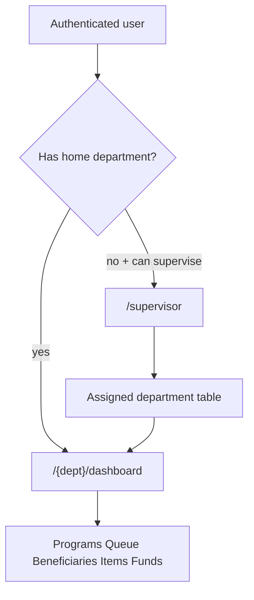

# Supervisor cross-department overview

Status: **planned** (not implemented). Roadmap item 6 in [cais-feature-roadmap.md](cais-feature-roadmap.md).

Supervisors need one place to compare work across departments they oversee, and a way to open each department’s existing pages without becoming that department’s staff. The `supervisor` role and `department.supervise` permission already exist, and departments already have an unused `supervisor()` belongs-to-many on `department_user`. Staff URLs still lock to `users.department_id`, so the role cannot see anything today.

This feature wires the pivot for **assigned departments only**, adds a dedicated overview page, and reuses existing `{department}/*` pages as **read-only**.



### Locked product rules

- A supervisor sees only departments attached on `department_user`, not every department in the system.
- Supervisors get **view** access in assigned departments. Create, update, delete, assign, claim, advance, and download stay blocked unless the user also has the matching resource role.
- Head already has `department.supervise`. Heads only see extra departments when they are on the pivot; they are not granted all departments.
- SuperAdmin keeps its existing bypass (`Gate::before` and middleware).

### Out of scope

- UI to assign supervisors to departments (attach via seeder/tests/admin tooling for now)
- Editing data in supervised departments without resource roles
- Aggregating every chart from the full department dashboard onto the overview
- Changing how home-department staff work inside their own department

---

## How this fits the current setup

| Piece | Today | After this feature |
| --- | --- | --- |
| `RoleName::Supervisor` | Seeded with only `department.supervise` | Same role, plus all `*.viewAny` / `*.view` permissions |
| `department_user` pivot | Migration + `Department::supervisor()` exist; unused for auth | Membership source for supervised departments |
| `EnsureUserBelongsToDepartment` | Home department or SuperAdmin | Home department, SuperAdmin, or supervise + pivot |
| Policies | `$user->department_id === $resource->department_id` | `User::canAccessDepartment(...)` |
| `/dashboard` | Redirects to home department, or “No department assigned” | Same, or redirect to `/supervisor` when the user can supervise and has no home department |

Aid, programs, items, funds, and workflows stay department-owned. Supervisors do not get a second copy of those records. They open the same routes staff already use.

---

## Access model

A user may enter a department URL when any of these is true:

1. SuperAdmin
2. Home `users.department_id` matches the route department
3. User can `department.supervise` **and** is attached to that department on `department_user`

### User helpers

On `User`:

- `supervisedDepartments()` — inverse of `Department::supervisor()`
- `canAccessDepartment(Department|int $department): bool` — home match, SuperAdmin, or supervise + pivot; memoize supervised IDs for the request so policies do not N+1

Use `canAccessDepartment` in:

- `EnsureUserBelongsToDepartment`
- All policy `$inDepartment` / `department_id ===` checks in `AssistancePolicy`, `ProgramPolicy`, `BeneficiaryPolicy`, `ItemPolicy`, `FundPolicy`, `WorkflowPolicy`
- View-only FormRequests that currently compare home department only: `Dashboard\IndexRequest`, notification index/show

Do **not** widen mutation FormRequests that skip policies (`BulkAssignRequest`, `BulkTransferRequest`). Those stay home-department-only.

### Permissions

Update `PermissionName::forRole(RoleName::Supervisor)` to return:

- `department.supervise`
- every `*.viewAny` and `*.view` permission

No create / update / delete / assign / claim / advance / download. Mutations still fail policy checks.

### Schema

Add a unique index on `department_user (user_id, department_id)` so the same assignment cannot be attached twice. Attach in tests/seeders with `$user->supervisedDepartments()->attach($department)`.

---

## Overview page

New route **outside** `{department}`:

| Method | Path | Name | Auth |
| --- | --- | --- | --- |
| `GET` | `/supervisor` | `supervisor.overview` | `can('department.supervise')` |

Empty state when the user has the permission but no pivot rows.

### Backend

- Thin `SupervisorOverviewController`
- `SupervisorOverviewService` querying assigned departments in bulk (one grouped assistance query + one grouped program-count query)
- Reuse filter/SQL helpers from `DashboardService`; do not call `summary()` once per department

Default year filter = current calendar year (same as the department dashboard).

Props:

- Totals: total requests, delivered, in progress, denied, unique beneficiaries, active programs
- Rows: department name/slug, those same counts, delivery rate, link to `user.dashboard.index`

### Frontend

`resources/js/pages/supervisor/overview.tsx`

- Reuse `KpiCards` / `DashboardStatCard`
- Department comparison table with links into each department dashboard
- Wayfinder imports from `@/routes` / `@/actions`

`GlobalDashboardController`: if the user has no home department but can supervise, redirect to the overview instead of the “No department assigned” screen.

---

## Existing department pages + nav

Supervisors with pivot assignments can open that department’s dashboard, programs, queue, workflows, beneficiaries, items, and funds. Queue claim/assign and create/edit actions stay 403 unless the user also has a resource role.

### Shared Inertia props

Via `HandleInertiaRequests`:

- `auth.canSupervise`
- `auth.isSuperAdmin`
- `auth.permissions` (permission name list; SuperAdmin still uses `isSuperAdmin`)
- `auth.supervisedDepartments` (`id`, `name`, `slug`)
- `currentDepartment` from the route `{department}` when present

### Sidebar (`app-sidebar.tsx`)

- “Overview” link when `canSupervise`
- Department picker when there are supervised departments; changing it visits that department’s dashboard
- Programs / Queue / etc. use the **current route department** when the user can access it, otherwise the home department

### Read-only UI

Hide primary create/mutation buttons on listing pages when the user lacks the matching permission (programs, queue bulk assign, items, funds, beneficiaries). SuperAdmin keeps them via `isSuperAdmin`. Server policies remain the real gate.

---

## Tests (Pest)

Helper in `tests/Pest.php`:

```php
assignSupervisorRole(User $user, Department ...$departments);
```

New `tests/Feature/SupervisorOverviewTest.php`:

- Forbidden without `department.supervise`
- Empty state with the role but no pivot rows
- Overview lists only assigned departments and aggregates their KPIs
- Staff from another department still cannot open a supervised URL
- Supervisor can `GET` assigned `{department}/dashboard` and `{department}/programs`
- Supervisor cannot create a program or assistance in an assigned department
- Unassigned department URLs stay 403

Extend `DepartmentAccessIsolationTest` and `RolePermissionPolicyTest` for the new membership rule.

Run `php artisan test --compact` on the new/updated files, then `vendor/bin/pint --dirty --format agent`.

---

## Implementation order

1. Unique index on `department_user`; `User::supervisedDepartments()` and `canAccessDepartment()`
2. Grant supervisor view permissions; update middleware, policies, and view FormRequests
3. `SupervisorOverviewService`, controller, route, Inertia page
4. Shared auth props; sidebar Overview + department picker
5. Hide mutation buttons without permission on listing pages
6. Pest helpers and feature tests; Pint
