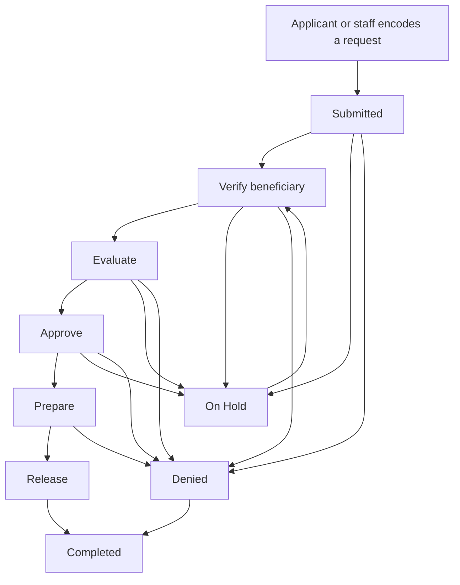

# CAIS user guide

CAIS is the Centralized Assistance Information System. A department uses it to record who asked for help, what they asked for, and what was actually released.

Two groups use it.

- **Applicants** open a public page. They do not need an account.
- **Staff** sign in and work inside their own department.

The home page sends staff to the sign-in screen. Applicants use **Apply** and **Track**.

## How a request moves

A request starts as a draft or as a submitted application. Staff then move it through the department workflow until it is released, denied, or closed.

The default pipeline is:

1. **Submitted.** The request is waiting for a first look. Target time: 48 hours.
2. **Verify beneficiary.** Staff check that the person or organization is the right record. Target time: 72 hours.
3. **Evaluate.** Staff check eligibility, documents, and the items asked for. Target time: 72 hours.
4. **Approve.** The request is approved for release. Target time: 48 hours.
5. **Prepare.** Staff get the goods, cash, or service ready. Target time: 48 hours.
6. **Release.** Staff record what was handed over.
7. **Completed.** The request is closed.

From most steps, staff can also:

- put the request **On Hold** while they wait for more information (the clock pauses)
- **Deny** the request (a comment is required)
- **Close** it without a release

A walk-in pipeline is shorter: Submitted, then Release, then Completed. Staff can release at the counter in one visit.

Each program uses either the department’s default workflow or a workflow chosen for that program. The buttons on a request are the moves allowed from the current step.

## If you are applying

Open **Apply for assistance**. The page lists departments and the programs that are open to the public. A program appears there only when all of these are true:

- staff turned on public intake
- the program is for individuals, not organizations
- the program is still open
- it is a one-off program or a batch, not the parent of a batch series

### Fill out the form

1. Choose the program.
2. Enter your name, birthday, sex, mobile number, and address. Mark the boxes that apply: person with disability, 4Ps, solo parent, or indigenous peoples.
3. Choose **Continue**. CAIS looks for a record that already matches your name, birthday, and barangay.
4. If a match appears, confirm that it is you, or choose **None of these, create a new profile**.
5. Enter the quantity you need for each item. Quantity `0` means you are not asking for that item. Answer any extra questions the program asks, and add remarks if you need to.
6. Tick the consent box, then choose **Submit request**.

After you submit, the confirmation screen shows your **CAIS number**. It looks like `PRO-2026-0001`. Write it down. Staff use it to find your request, and you use it to check the status.

### Save and come back

Choose **Save for later** if you are not ready to submit. Consent is not required for a draft. The confirmation still shows a CAIS number.

To continue:

1. Open **Track a request**.
2. Enter the CAIS number and your last name.
3. On a saved draft, choose **Continue application**.

Tracking also shows the status of requests you already submitted, the program name, and the date requested. It does not show requests that staff encoded only inside the office.

### Kiosk

A shared terminal can open the same form with a kiosk screen. After you submit or save, that screen returns to the program list after a few seconds. Still write down the CAIS number before it leaves.

## If you are staff

Sign in with the email and password on your account. If two-factor authentication is on, enter the code from your authenticator app, or a recovery code.

After sign-in you land on your department dashboard. The sidebar shows the pages your role allows:

| Page | What it is for |
| --- | --- |
| Dashboard | Counts, charts, and a short program list for your department |
| Programs | The aid programs you encode into |
| Queue | Requests assigned to you, and unassigned work for the team |
| Beneficiaries | People and organizations |
| Items | Goods, cash, and services, plus stock for goods |
| Funds | The budgets linked to programs |
| Notifications | Assignments, due work, returned tasks, and low stock |
| Admin | Accounts and workflows. Super admins only |

A guided tour is available on the main department pages. It points at the sidebar, filters, and the create buttons.

Your account menu holds profile, security, and appearance.

### What each role can do

A person can hold more than one role. The sidebar and the buttons follow those roles.

| Role | Typical work |
| --- | --- |
| Assistance | View, encode, edit, assign, claim, and move requests |
| Program | Create and update programs, and export their request lists |
| Beneficiary | Add and update people and organizations |
| Item | Maintain the item list and stock |
| Fund | Maintain funds |
| Workflow | Work with the department’s workflow tasks, including assign and reassign |
| Head | Every staff action in the department |
| Super admin | Create staff accounts, and build, publish, and activate workflows |

You only see another department’s records if you are a super admin. Everyone else stays in the department on their account.

## Set up a program before requests arrive

Do this once for a new aid run. Later requests reuse the same setup.

### 1. Add funds

Open **Funds** and add a fund with a name, amount, and year. You will attach it when you create the program.

### 2. Add items

Open **Items** and add each thing the program can give out.

- **Goods** are physical items. They use a unit such as sack, piece, or kilo, and they are the only kind that tracks stock.
- **Cash** is recorded as an amount in pesos.
- **Service** is recorded as a quantity and unit, with no stock count.

You can classify a goods item with a UNSPSC code so later reports can group what was released.

For goods, open the item’s stock drawer:

- **Receipt** adds stock that arrived. You can record a batch number and an expiry date.
- **Allocate** sets aside quantity for a program.
- **Adjust** records stock in or stock out, with a reason.

When on-hand stock for a goods item runs low, CAIS sends a low-stock notification.

### 3. Create the program

Open **Programs** and start a new program.

Choose one type:

- **One-off program.** Staff encode directly into this program.
- **Program with batches.** The parent holds the name, description, items, questions, document rules, and eligibility. Staff encode only into a batch, such as Batch 1 for January to March. Add the first batch while you create the parent, or add later batches from the parent page.

Then set:

- start and end dates
- whether the program is **Open** or **Closed** (closed programs do not accept new requests)
- funds and items
- extra questions applicants and staff must answer
- a document checklist
- eligibility rules
- the workflow, if this program should not use the department default
- **Organization program**, when the aid is for groups rather than people
- **Enable public intake**, on an individual one-off program or on an individual batch, when residents should apply from the public form

Copy the public intake link from the program page and share it, or open it on a kiosk.

## Beneficiaries

Open **Beneficiaries** to search the registry or add a record.

- An **individual** receives a CAIS number that starts with `PRO`, such as `PRO-2026-0001`.
- An **organization** receives a number that starts with `ORG`.

For a person, record the name, birthday, sex, civil status, address, mobile number, and the same demographic marks used on the public form. You can also store ID numbers.

If PhilSys eVerify is turned on for the office, verify the person before you save. The screen offers face or fingerprint when those methods are configured. If eVerify is off, enter the record by hand.

CAIS warns when a new person looks like someone already in the registry. Confirm the existing record when it is the same person.

Open a beneficiary to see their assistance history.

## Record a request in the office

Open an open one-off program or an open batch. A parent program has no encode button.

Choose **Add** on the assistance list.

1. Search for the beneficiary by CAIS number or name. Create the person or organization first if they are not in the registry.
2. Choose how the request arrived: Letter, Text, Call, Email, Walk In, or Online. Public applications are stored as Online.
3. Enter the requested items and any program questions.
4. Read the eligibility panel before you save.

Eligibility uses the rules on the program, or on the parent when you are encoding into a batch.

| Finding | What happens |
| --- | --- |
| Wrong demographic type, or the person is not PWD, 4Ps, solo parent, or indigenous when the program requires it | CAIS blocks the request |
| The person already has an open request in this program or its batches | You can continue only if you enter a reason |
| The last delivery is still inside the cooldown | You can continue only if you enter a reason |
| A released quantity would pass the item cap | You can continue only if you enter a reason |

The panel also shows earlier assistance for that person, including what was released.

After you save, the request enters the workflow at Submitted, unless the workflow says otherwise. Public drafts stay at Draft / Saved For Later until the applicant submits them.

## Work the queue

Open **Queue**.

- **My queue** lists requests assigned to you.
- **Team queue** lists unassigned work waiting for someone with the right role. Turn on include-assigned when you also want to see work that already has an owner.

Filter by program, status, or time state:

| Time state | Meaning |
| --- | --- |
| On time | Inside the step’s target hours |
| Due soon | Close to the due time |
| Overdue | Past the due time |
| Paused | On Hold, so the clock is stopped |

Open a row to see the request. If the current task has no assignee and you are allowed to take it, choose **Claim task**. Supervisors with assign permission can assign one request, or several from the team queue, to a staff member.

## Work one request

The request page shows the CAIS number, beneficiary, how the request arrived, who encoded it, who it is assigned to, and the current step.

### Move the workflow

**Current task** lists the step, the task, the assignee, and the due time. The buttons under it are the allowed moves, such as advance, hold, deny, or close. A deny asks for a comment.

Only the assignee for the current stage can change the status. If you are not the assignee, the page says so.

You can also change the assignee from **Assistance tracking** when you have permission to assign.

### Attach documents

The document section follows the program checklist. Typical files are a valid ID, an indigency certificate, a delivery photo, a signed acknowledgment, or another file.

Each required document is due either **before Verified** or **before Delivered**. CAIS will not let the request reach that point while a required file is missing. You can still attach extra files that are not on the checklist.

### Release the items

When you set the status to a delivered status, record what was handed over.

Keep the original request. Record the release separately.

| What happened | What to record |
| --- | --- |
| You gave what they asked for | Mark that requested line received. You cannot release more than the remaining requested quantity on that same line. |
| You gave only part of a line | Release the quantity you handed over. The rest stays pending, and the status can be Partially Delivered. |
| You also gave something they never asked for | Add it as an **additional** item and enter a reason. |
| You gave a different item instead | Mark the requested line as substituted, add the replacement as a **substitute**, and enter a reason. |
| You gave more than they asked for | Release the requested quantity, then add the extra as an additional line of the same item. |

Additional and substitute lines must still be items on the program. Released goods reduce stock. Eligibility caps count released quantities, including extras and substitutes.

### Print the acknowledgment

Open the receipt from the request. It prints:

- the CAIS number and beneficiary
- the date requested and the date delivered
- items requested, with requested quantity and released quantity
- items actually released, including additional and substitute lines
- a QR code that opens the request

### Other actions on the list

From a program’s assistance table you can:

- edit a request that is still open to edits
- copy the CAIS number
- transfer the request to another program in the department
- delete a request, when your role allows it
- update status for several selected rows
- transfer several selected rows
- export the filtered list as CSV or Excel

## Read the dashboard

The department dashboard summarizes the period you filter. Use the filters to change the dates and programs behind the numbers.

You will see request and delivery counts, requests by status, items handed over by program, released quantities by UNSPSC classification, top delivered items, demographics, and a short list of programs.

## Notifications

Open **Notifications** in the sidebar. The badge is the number still unread.

CAIS notifies you when:

- a request or workflow task is assigned or reassigned to you
- someone claims a task
- a task moves to a new step
- a task is returned
- a task is due
- a request has been sitting too long
- a goods item is low on stock
- an account invite is sent

Open a notification to read it, mark one as read, or mark all as read.

## Your account

From the account menu:

- **Profile** updates your name and email. A changed email must be verified.
- **Security** changes your password and turns two-factor authentication on or off. When you enable it, scan the QR code and store the recovery codes.
- **Appearance** switches the theme.

Use **Forgot password** on the sign-in page if you cannot get in. You need access to the email on the account.

## For super admins

### Accounts

Open **Admin**, then **Users**.

Create a user with a name, email, department, and one or more roles. The person receives an invite and sets a password. Leave the department empty only for an account that should not work inside a department page.

You can update roles and department later, or remove an account.

### Workflows

Open **Admin**, then **Workflows**.

A workflow belongs to one department. Create it with a name, code, description, and version, then lay out the steps and the moves between them. Each step has a request status, an optional reason such as Under Review or Ready for Release, a target time in hours, and who should own the task.

When the pipeline is ready:

1. **Publish** it.
2. **Activate** it.
3. Assign it to programs, or leave programs on the department default.

You can duplicate a workflow or start a new version. On a live request you can reassign the current task or override it when the normal buttons are not enough.

New departments start with an active **Standard Assistance Workflow**: Submitted, Verify beneficiary, Evaluate, Approve, Prepare, Release, and Completed, with On Hold and Denied beside that path.

## Status words

The request has a main status and a more specific reason.

| Status | Reason you may see | Meaning |
| --- | --- | --- |
| Draft | Saved For Later | The applicant saved the public form and has not submitted it |
| Submitted | Awaiting Review | It is in and waiting for staff |
| Review | Under Review, Pending Documentation, or Verified | Staff are checking the person, the papers, or the request |
| Approved | Approved or Ready for Release | It may be prepared or released |
| Delivered | Delivered or Partially Delivered | Some or all of the release is recorded |
| Denied | Denied or Duplicate | Staff refused it, or it duplicates another request |
| Closed | Closed | The file is finished |
| On Hold | Awaiting Information | Staff are waiting, and the time target is paused |

Delivered, Denied, and Closed are finished statuses. A finished request no longer sits in the active queue.

## Quick reference

| I want to… | Go to… |
| --- | --- |
| Apply | Apply for assistance |
| Check my request | Track a request, with CAIS number and last name |
| See department totals | Dashboard |
| Add a person | Beneficiaries, then create |
| Encode a walk-in | The open program or batch, then add assistance |
| Pick up unassigned work | Queue, Team queue, then Claim task |
| Release goods | The request, set a delivered status, record the lines |
| Print proof of release | The request receipt |
| See what is assigned to me | Queue, My queue, or Notifications |
| Let residents apply online | Program or batch, Enable public intake |
